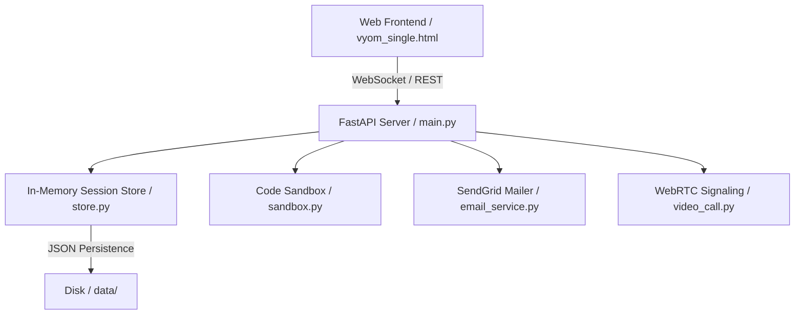

# VYOM — Virtualized Youth Optimization & Mentorship

VYOM is an intelligent, real-time learning, collaboration, and mentorship platform designed to optimize student growth and classroom interactions through modern technology, rich analytics, structured communication, and guided mentorship.

---

## Overview

VYOM (Virtualized Youth Optimization & Mentorship) provides an immersive, interactive environment where teachers can deliver live lessons, distribute quizzes/assignments, evaluate student coding submissions in a safe sandboxed environment, launch WebRTC-based video conferences, and monitor classroom engagement using real-time telemetry and analytics.

---

## Features

- **Live Session Controls**: Synchronized session state with waiting room management, student admission lists, and automated session end timers.
- **Smart Attendance**: Geo-fenced attendance tracking, duration-based verification, and real-time roll submission guardrails.
- **Interactive Coding Lab**: Safely execute code (Python, JavaScript, C++, C, Java, Go) using our custom sandbox with runtime time-outs and stdout/stderr limit enforcement.
- **Real-Time Analytics**: Live evaluation dashboard tracking understanding, class participation, and auto-flagging at-risk students.
- **Integrated Video Conferencing**: High-fidelity WebRTC-based multi-user video calling with zero external dependencies (pure WebSocket-based signaling).
- **Automated Reporting**: Professional HTML/text reports and OTP login verification using SendGrid integration.
- **PWA Support**: Responsive, standalone mobile layout with manifest support and customized SVG icon indicators.

---

## Architecture



- **Frontend**: Single-Page Application (SPA) built using React 18, Chart.js, Tailwind CSS aesthetics, and raw CSS gradients.
- **Backend**: Python-based FastAPI server utilizing WebSockets for live bi-directional synchronization.
- **Security Sandbox**: Subprocess-based Python code execution using strict namespace blocking and sys-level resource limits.

---

## Installation

1. **Clone the Repository**:
   ```bash
   git clone https://github.com/Satyanderkaushik2004/VYOM.git
   cd VYOM
   ```

2. **Configure Python Environment**:
   Ensure Python 3.11+ is installed. Create a virtual environment and install dependencies:
   ```bash
   python -m venv .venv
   .venv\Scripts\activate
   pip install -r requirements.txt
   ```

---

## Configuration

Duplicate `.env.example` as `.env` and configure the environment variables:
```ini
PORT=8003
HOST=0.0.0.0
DEBUG=True

# Persistence (json or none)
PERSISTENCE=json
DATA_DIR=data

# SendGrid Email Integration
SENDGRID_API_KEY=SG.your_api_key_here
SENDGRID_FROM_EMAIL=vyom7@gmail.com

# Admin Authentication
ADMIN_USERNAME=admin
ADMIN_PASSWORD=vyom123

# Google OAuth Config
GOOGLE_CLIENT_ID=your-google-client-id.apps.googleusercontent.com
GOOGLE_CLIENT_SECRET=your-google-client-secret
```

---

## Deployment

VYOM can be deployed as a Docker container (perfect for Google Cloud Run, AWS App Runner, or Render):
```bash
docker build -t vyom-app .
docker run -p 8080:8080 -e PORT=8080 -e PERSISTENCE=json vyom-app
```

---

## Security

1. **Process Isolation**: Coding assignments are executed in separate sandboxed subprocesses with limited permissions.
2. **Access Control**: Session joining is secured through waiting rooms and teacher approval logs, or optional CSV-based student admission lists.
3. **Geo-Fencing**: Closed access mode uses GPS validation to match student latitude/longitude with teacher coordinates within a configurable radius.

---

## Contribution Guide

1. Fork the repository.
2. Create your feature branch (`git checkout -b feature/amazing-feature`).
3. Commit your changes (`git commit -m 'feat: Add amazing feature'`).
4. Push to the branch (`git push origin feature/amazing-feature`).
5. Open a Pull Request.
